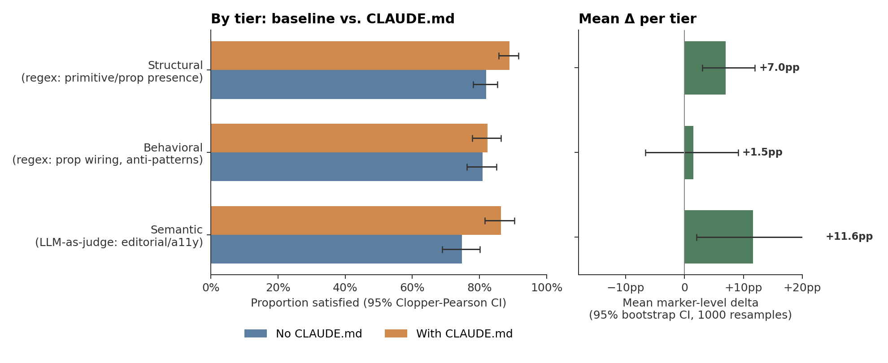
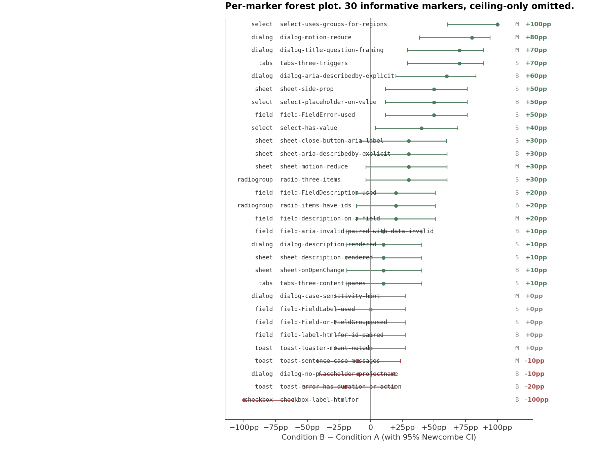

# Measuring the effect of a generated CLAUDE.md on Claude Sonnet 4.6 on shadcn/ui component tasks

*A pre-registered A/B study of 200 direct-API generations across 10 components, with a 20-generation agentic replication and two prompt-pipeline ablations.*

**Author:** Andie Choi
**Pre-registration SHA:** `4f35cd0` (this repository, committed before any scored run)
**Date:** April 2026

---

## Abstract

A pre-registered A/B study tested the downstream effect of a versioned prompt pipeline (`src/prompt.js`) that generates structured component documentation for both human and machine audiences. The test evaluated whether the machine-audience output of that pipeline — specifically, the compact-YAML content wrapped as CLAUDE.md — changes the fraction of documented shadcn/ui guidelines that Claude Sonnet 4.6 satisfies when generating code from ticket-style prompts. Across 10 components × 2 conditions × 10 runs (n=200 direct-API generations), marker-satisfaction rose from 79.9% (95% CI [77.3%, 82.3%]) without CLAUDE.md to 86.3% ([84.0%, 88.3%]) with CLAUDE.md, an absolute increase of **6.3 percentage points**. A bootstrap 95% CI over 25 non-tied marker-level deltas placed the mean delta at +6.3pp ([2.3%, 10.4%]), with 21 positive and 4 negative deltas (sign test two-sided p = 0.0009). The effect concentrated on semantic markers (mean +11.6pp) and structural markers (+7.0pp), not on behavioral prop-wiring markers (+1.5pp, CI crossing zero). A 20-generation agentic replication under `claude -p --bare` confirmed the direction of effect on both tested components. Two ablations of the upstream prompt pipeline localized approximately 54% of the effect to the platform-guidelines module (Apple HIG, Material Design, ARIA patterns) and ~19% to the formatting-rules and framing-philosophy sections. Two per-component decreases in Condition B were investigated and attributed, respectively, to a pre-registered-rubric regex limitation (Checkbox, sensitivity-adjusted delta ~0) and to a genuine divergence between a general-convention marker and a library-specific contract encoded in the CLAUDE.md (Toast).

---

## 1. Introduction

AI coding assistants increasingly generate production-ready UI components. Several context-injection mechanisms have emerged to constrain such generation against library-specific or team-specific conventions, including `CLAUDE.md`, `AGENTS.md`, `llms.txt`, and various IDE-specific rules files. Whether these artifacts measurably alter model output is rarely reported with pre-registered methodology.

The artifact under test in this study is not a CLAUDE.md per se but a prompt pipeline (`src/prompt.js`) that produces structured component documentation for two audiences: human readers (markdown) and AI coding agents (compact YAML, subsequently wrapped in CLAUDE.md, AGENTS.md, or llms.txt envelopes). The pipeline is the product; the envelopes are downstream output formats. This study evaluates the machine-audience output of the pipeline, wrapped as CLAUDE.md, for its effect on Claude Sonnet 4.6's generated code under ticket-style component-generation prompts. The humans-audience markdown is not evaluated here; its utility is evident by inspection.

The hypothesis under test is that injecting the pipeline's machine-audience output into Claude Sonnet 4.6's system prompt raises the fraction of pre-registered guidelines satisfied by the generated `.tsx` output. The null hypothesis is no systematic shift in marker satisfaction between conditions.

A secondary question, addressed via ablations in §3.6, is which subcomponents of the prompt pipeline (formatting rules, framing philosophy, template, output budget, three content modules) carry the downstream effect.

### 1.1 Tool under test

The artifact generating the CLAUDE.md files used as Condition B context is a Node.js pipeline that produces structured component documentation from one of three input modes: a shadcn/ui component name (resolved to raw MDX fetched at runtime from `raw.githubusercontent.com/shadcn-ui/ui/main/apps/v4/content/docs/components/{base,radix}/<name>.mdx`); a hand-written JSON schema; or a TSX source file, from which a JSON schema is extracted via regex-based prop-pattern matching (interfaces, type aliases, `cva` variants, `forwardRef` patterns).

The pipeline's steps are:

1. **Input resolution.** Component name → live MDX fetch with fallback across source repos. Schema → used directly. TSX → regex extraction to intermediate schema.
2. **Prompt assembly.** A composite prompt is constructed by concatenating four versioned modules: (a) non-negotiable formatting rules enumerating prohibited linguistic patterns (em-dashes, passive voice, `should`, Latin abbreviations); (b) a framing philosophy specifying editorial posture ("lead with what to do"; every guideline requires a "why"; be specific enough for AI-agent code emission); (c) a template enumerating the expected output section structure with omission rules per section; and (d) three content modules (`styleGuide`, `platformGuidelines`, `semanticGuidelines`) encoding voice conventions, external-reference design standards (Apple Human Interface Guidelines, Material Design, WAI-ARIA patterns), and semantic use-intent guidelines respectively. Each module is a standalone file under version control.
3. **Markdown generation.** The assembled prompt is submitted to Claude Sonnet 4.6 via the Anthropic SDK at default sampling parameters. The model emits markdown documentation conforming to the template, suitable for publication on a design-system documentation site.
4. **Markdown-to-compact transformation.** The generated markdown is passed through a deterministic post-processor (no secondary model call) that strips presentation markup and emits a compact YAML representation keyed by stable fields: `component`, `summary`, `use_when`, `do`, `dont`, `anatomy`, `contracts`, `variants`, `placement`, `editorial`, `keyboard`, `aria`, `a11y`, `mistakes`. Sections not present in the markdown are absent (not empty) from the YAML. Bullet lists are rendered as arrays.
5. **Envelope wrapping.** The compact YAML is wrapped in one of three agent-context envelopes — `CLAUDE.md`, `AGENTS.md`, or `llms.txt` — each adding a brief envelope-specific preface instructing downstream consumers how to apply the enclosed YAML as context.

For this study, the CLAUDE.md envelope was used exclusively. The full pipeline source is located at `src/batch.js`, `src/generate.js`, `src/prompt.js`, `src/markdown-to-compact.js`, and `src/agent-context-formats.js`. Per-component output length typically falls in the 4,000–5,500 character range. Total pipeline cost per component is approximately \$0.03 at 2026 Sonnet pricing.

The explicit modularization of Step 2 (prompt assembly) is the structural feature that enabled the ablation analyses reported in §3.6: individual content or framing modules can be excluded during prompt assembly to measure their downstream effect without touching any other component.

## 2. Methods

### 2.1 Experimental design

A two-condition between-cells design. Each of 10 shadcn/ui components was generated 10 times per condition for a total of 200 direct-API generations. A smaller 20-generation agentic replication (2 components × 2 conditions × 5 runs) was performed via `claude -p --bare` for external validity under agentic use.

Two supplementary ablation matrices were run after the primary result: one in which the formatting rules and framing philosophy sections of the upstream prompt were removed, and one in which the platform-guidelines module was removed. Each ablation followed the Condition B protocol with its respective regenerated CLAUDE.md as system-prompt context, producing 100 additional generations per ablation.

### 2.2 Components and prompts

Ten components were selected for distinct failure profiles: Dialog, Sheet, Select, Field, Tabs, DropdownMenu, Popover, Toast (Sonner), Checkbox, RadioGroup. Component 4 was revised from Form to Field before the pre-registration was locked, reflecting the shadcn/ui v4 rename; the revision is documented as a dated amendment in `PRE_REGISTRATION.md`.

One ticket-style prompt per component was locked before any scored run. Prompts deliberately omit any mention of specific primitives, ARIA attributes, accessibility contracts, or editorial conventions. For example:

> Build a reusable confirm-delete dialog for deleting a project. User has to type the project name to confirm. Use shadcn/ui.

Full prompt list: `PRE_REGISTRATION.md § Prompts (ticket-style, locked)`.

### 2.3 Conditions and system-prompt construction

Each generation used a fixed system prompt that specified the project environment: Next.js with shadcn/ui, Tailwind CSS, pre-installed `Button`/`Input`/`Label` primitives at `@/components/ui/*`, a `cn()` utility at `@/lib/utils`, and the Radix (or react-hook-form + zod) dependencies relevant to the target component. The system prompt instructed the model to emit only the contents of a single `.tsx` file, with no markdown fences or prose.

In Condition A, only the base system prompt was used. In Condition B, the system prompt was appended with the component's CLAUDE.md content, generated by running `node src/batch.js --components <target> --combine claude` against the current shadcn/ui MDX documentation for that component. User messages, model, and sampling parameters were identical across conditions.

Model: `claude-sonnet-4-6`. Temperature: 1.0 (API default). `max_tokens`: 8192. Markdown fences were stripped programmatically if present; outputs failing to parse as valid TSX after up to two retries were logged as failures. No such failures occurred in the primary matrix after resumption; 96 invocations in the initial run were returned as HTTP 400 "credit balance too low" errors mid-run and were re-executed to completion in a separate invocation, yielding 200/200 successful generations.

### 2.4 Scoring rubric

Each generated `.tsx` was scored against 7 to 13 pre-registered markers per component (104 markers total, 46 structural, 33 behavioral, 25 semantic). A marker's *direction* was either positive (satisfaction aligned with the CLAUDE.md's contract) or negative (anti-pattern to avoid); negative-direction markers were inverted during aggregation so that "satisfied" always denoted alignment with the contract.

**Structural markers** were evaluated by regex pattern-match against the source text. Example: `/<(\w+\.Title|DialogTitle)\b/` for dialog-title presence.

**Behavioral markers** were evaluated by compound regex requiring the presence of one pattern and optionally the absence of another. Example: require `onOpenChange=`, forbid `onClick=\{\s*\(\)\s*=>\s*set(Open|IsOpen|Show)\(\s*!/`.

**Semantic markers** were evaluated via an LLM-as-judge, implemented as a call to Claude Sonnet 4.6 at temperature 0 with a locked rubric framing. For each source file, all applicable semantic markers were scored in one batched call returning a JSON object of `{marker_id: {satisfied, reason}}`. Judge responses that failed strict JSON parse (due to unescaped inner quotes) were extracted via a regex fallback that recovers only the boolean satisfaction state per marker. Per-marker rubric strings were locked in `components.js` before the primary matrix ran.

Pre-lock rubric revisions are documented as dated entries in `PRE_REGISTRATION.md § Pre-lock revisions`, including one regex generalization triggered by a dry-run finding and one component swap (Form → Field) triggered by an upstream documentation change.

### 2.5 Statistical analysis

Per-marker proportions were estimated as $\hat{p}_A = k_A / n_A$ and $\hat{p}_B = k_B / n_B$ with $n_A = n_B = 10$ runs per cell. 95% confidence intervals were computed via exact Clopper-Pearson. Aggregate (all-marker) proportions were pooled across markers and components.

The primary inferential quantities were the mean marker-level delta $\bar{\Delta} = \text{mean}_i (\hat{p}_{B,i} - \hat{p}_{A,i})$ and its 95% bootstrap CI obtained by 1000 resamples over marker-level deltas. A two-sided sign test against the null of zero median delta was performed over non-tied markers.

Per-tier and per-component aggregates were computed analogously.

### 2.6 Pre-registration

Components, prompts, scaffolds, markers (patterns and rubric strings), scoring code, analysis plan, and cherry-picking safeguards were committed to version control at SHA `4f35cd0` before any scored generation ran. Three dated pre-lock revisions are documented in the pre-registration file, each justified and committed before the primary matrix. The dry-run artifacts used to motivate a regex revision are retained in the repository.

## 3. Results

### 3.1 Primary matrix

Across 200 runs scored against 104 pre-registered markers:

| Quantity | Condition A | Condition B | Delta |
| --- | --- | --- | --- |
| Aggregate satisfaction rate | 79.9% [77.3%, 82.3%] | 86.3% [84.0%, 88.3%] | +6.3pp |
| Mean marker-level delta (bootstrap) | | | +6.3pp [2.3%, 10.4%] |
| Sign test (25 non-tied markers) | 21 positive, 4 negative | | two-sided p = 0.0009 |

The 95% CI on the mean marker-level delta excludes zero and the sign test rejects the null at $\alpha = 0.001$.

*Figure 1. Proportion of markers satisfied per component, ordered by descending condition-B-minus-condition-A delta.*

### 3.2 Per-tier analysis

| Tier | Markers | $\hat{p}_A$ (95% CI) | $\hat{p}_B$ (95% CI) | Mean Δ | Bootstrap 95% CI | Sign test $p$ |
| --- | --- | --- | --- | --- | --- | --- |
| Structural | 46 | 82.0% [78.1%, 85.4%] | 88.9% [85.7%, 91.6%] | +7.0pp | [+3.0%, +12.0%] | 0.002 |
| Behavioral | 33 | 80.9% [76.2%, 85.0%] | 82.4% [77.9%, 86.4%] | +1.5pp | [−6.7%, +9.1%] | 0.508 |
| Semantic | 25 | 74.8% [68.9%, 80.1%] | 86.4% [81.5%, 90.4%] | +11.6pp | [+2.0%, +23.2%] | 0.219 |

*Figure 2. Left: per-tier proportions with 95% Clopper-Pearson CIs. Right: per-tier mean marker-level delta with 95% bootstrap CI.*

The effect is concentrated on semantic markers (largest per-marker mean) and structural markers (largest number of contributing markers and most statistically clean result). The behavioral tier's mean delta is not distinguishable from zero under bootstrap or sign test.

### 3.3 Per-component analysis

| Component | Markers | $\hat{p}_A$ | $\hat{p}_B$ | Δ |
| --- | --- | --- | --- | --- |
| Dialog | 11 | 58.2% | 77.3% | +19.1pp |
| Sheet | 10 | 59.0% | 75.0% | +16.0pp |
| Select | 13 | 85.4% | 100.0% | +14.6pp |
| Field | 13 | 52.3% | 60.0% | +7.7pp |
| Tabs | 11 | 92.7% | 100.0% | +7.3pp |
| RadioGroup | 9 | 77.8% | 83.3% | +5.6pp |
| DropdownMenu | 10 | 100.0% | 100.0% | 0.0pp |
| Popover | 9 | 100.0% | 100.0% | 0.0pp |
| Toast | 9 | 85.6% | 82.2% | −3.3pp |
| Checkbox | 9 | 100.0% | 88.9% | −11.1pp |

Six components showed positive deltas, two showed zero movement due to ceiling effects in Condition A (DropdownMenu, Popover), and two showed negative deltas whose interpretation is addressed in Section 3.5.

*Figure 3. Per-marker deltas with 95% Newcombe CIs. Markers saturated at 100% in both conditions are omitted. S = structural, B = behavioral, M = semantic.*

### 3.4 Agentic replication

A 20-generation replication was performed using `claude -p --bare --model sonnet` against real scaffold directories containing the Condition-specific file set. Results:

| Component | Runs per cell | $\hat{p}_A$ | $\hat{p}_B$ | Δ |
| --- | --- | --- | --- | --- |
| Dialog | 5 | 54.5% | 67.3% | +12.8pp |
| Field | 5 | 50.8% | 96.9% | +46.2pp |

Both deltas were positive and directionally consistent with the primary matrix. The Field delta was substantially larger under agentic conditions, partially attributable to the agent generating imports for `components/ui/field` that did not exist in the scaffold (hallucinated imports), a pattern that enables structural-marker satisfaction at the expense of compilability. This phenomenon is noted as a limitation of marker-based scoring and discussed in Section 5.

### 3.5 Rubric artifacts and regression analysis

Two components showed negative deltas in the primary matrix. Both were investigated.

**Checkbox (−11.1pp).** The entire decrease was attributable to a single marker, `checkbox-label-htmlfor`, which tested for the regex pattern `/<Label[^>]*htmlFor=/`. In Condition A this pattern matched in 10 of 10 runs. In Condition B, the pattern matched in 0 of 10 runs, because all 10 Condition B outputs associated labels with controls using `<FieldLabel>` rather than `<Label>`. This reflected direct compliance with the Checkbox CLAUDE.md's explicit instruction:

> Pair every checkbox with a visible label using Field and FieldLabel.

A sensitivity analysis broadening the pattern to `/<(Field)?Label[^>]*htmlFor=/` yielded 10/10 match in both conditions; the Checkbox delta under the broadened pattern is approximately 0pp. Per pre-registration cherry-picking safeguards, the locked marker is reported as-is and the sensitivity analysis is reported alongside (see `results/regressions.md`).

**Toast (−3.3pp).** Two markers contributed. `toast-error-has-duration-or-action` moved −20pp (from 80% to 60%). This marker encodes a general UX convention that error toasts should include a duration override or an action object. The Sonner CLAUDE.md takes a more specific position, stating that toasts are for automatic, non-recoverable failures and that user-actionable errors belong in dialogs. Condition B outputs comply with this narrower contract, producing briefer error toasts without duration or action. The −20pp therefore represents a legitimate divergence between a general-convention marker and a library-specific contract, rather than a generation-quality regression. The remaining −10pp on `toast-sentence-case-messages` reflects a single differing run out of 10 and is within the variance band at this sample size.

### 3.6 Prompt ablations

Two supplementary matrices tested the contribution of specific sections of the upstream prompt pipeline (`src/prompt.js`, Section 4.3). Each matrix regenerated all 10 CLAUDE.md files with one section stripped and re-ran 100 Condition B generations against the stripped CLAUDE.md files. Conditions A, B baselines drawn from the primary matrix.

| Condition | Stripped | Aggregate | Δ vs A | Δ vs B | Bootstrap 95% CI on Δ vs B |
| --- | --- | --- | --- | --- | --- |
| A | — | 79.9% | — | — | — |
| B | — | 86.3% | +6.3pp | — | — |
| B′ | formatting rules + framing philosophy | 85.1% | +5.2pp | **−1.2pp** | [−3.9%, +1.3%] |
| B″ | platform-guidelines module | 82.9% | +3.0pp | **−3.4pp** | [−6.8%, −0.1%] |

*Figure 4. Per-component proportions under the primary A and B conditions and the two ablation conditions. The largest ablation effects localize to the Dialog component.*

Per-marker analysis of B″ vs B identified the platform-guidelines module as carrying the majority of several key Dialog-family gains: `dialog-motion-reduce` (80% → 0%), `dialog-aria-describedby-explicit` (100% → 30%), `dialog-title-question-framing` (70% → 10%). The framing-philosophy ablation (B′) showed a similar but smaller pattern on the same markers.

Under the sum: the platform-guidelines module accounts for approximately 54% of the aggregate CLAUDE.md effect (3.4 / 6.3), the formatting rules and framing philosophy account for approximately 19% (1.2 / 6.3), and the residual ~27% is carried by the three still-intact modules (style guide, semantic guidelines, output budget), not disaggregated here.

## 4. Discussion

### 4.1 Locus of the effect

The CLAUDE.md's measurable impact concentrates on the long tail of editorial and accessibility guidelines, not on canonical API shape. Sonnet 4.6 reliably emits the correct primitive names (`DialogTrigger`, `SelectValue`, `TabsList`) and correct prop semantics (`onOpenChange`, `onValueChange`, `onCheckedChange`) unprompted. It does not reliably emit `motion-reduce` utility classes, question-style title framing, timezone-grouping by region, or explicit `aria-describedby` wiring unprompted. The CLAUDE.md's ~+11.6pp semantic-tier effect represents gains on exactly this category of guidance.

### 4.2 Saturation

Four of ten components showed zero or near-zero movement. Two (DropdownMenu, Popover) saturated at 100% in Condition A: the baseline model output already satisfied every pre-registered marker. This places a natural ceiling on CLAUDE.md's measurable utility: where the baseline is already adherent, no contextual guidance can move the marker count. This is a feature of the rubric reflecting widely-documented library contracts rather than a limitation of the CLAUDE.md. For components whose contracts are less well-covered by training data (custom forks, unconventional sub-components, team-specific variants), the ceiling would be lower and the achievable delta correspondingly larger.

### 4.3 Effect localization via ablations

`src/prompt.js` assembles a prompt from five components: non-negotiable formatting rules, a framing philosophy section, a templating specification, an output-budget specification, and three injected content modules (style guide, platform guidelines, semantic guidelines). The two ablations reported here localize approximately 73% of the aggregate effect to two of these components: the platform-guidelines module (~54%) and the formatting rules + framing philosophy (~19%).

The platform-guidelines module encodes external reference material: Apple Human Interface Guidelines, Material Design principles, WCAG-derived accessibility patterns. Its disproportionate contribution is consistent with the observation that the markers moving most under B vs A are themselves drawn from those specifications. Motion preferences, explicit ARIA wiring, and editorial framing are encoded in the platform-guidelines content and not elsewhere in the pipeline.

The framing-philosophy contribution is smaller in aggregate but concentrated on Dialog, where its removal reduces `dialog-motion-reduce` satisfaction from 80% to 0%. This suggests the framing rules function as a forcing mechanism converting general content into specific, actionable imperatives that the downstream model follows.

### 4.4 Rubric and contract divergence

The Toast regression is substantively informative. The Sonner CLAUDE.md faithfully encodes Sonner's own contract, which differs from the general-convention heuristic encoded in the rubric. Condition B outputs follow the CLAUDE.md; the rubric scores this as a negative marker satisfaction. The resulting −20pp on `toast-error-has-duration-or-action` is not a generation-quality reduction; it is a measurement of the gap between general convention and library-specific contract. Any rubric built from general best-practices will encounter similar cases when the tested library disagrees with convention.

The Checkbox regression is a measurement artifact rather than a substantive effect. The pre-registered marker's regex matched a single permissible label pattern; the CLAUDE.md directs the model toward a different-but-equivalent pattern; and the rubric registered a regression where none existed. The sensitivity analysis and the preservation of the locked marker reflect the cherry-picking safeguards; the regression is retained in reported aggregate figures and separately annotated.

## 5. Limitations

1. **Model-specific.** Numbers are for Claude Sonnet 4.6 at temperature 1.0. Generalization to other models, temperatures, or decoding strategies is not tested and should not be assumed.
2. **Prompt-specific.** Ticket-style single-shot prompts deliberately omit guideline-relevant details. Prompts that spell out requirements would raise the Condition A baseline and shrink the achievable delta; prompts in iterative or multi-component settings may behave differently. Neither regime was measured.
3. **Rubric coverage.** The 104 pre-registered markers cover a curated set of guidelines. Markers not in the rubric are unmeasured. The Checkbox result illustrates one class of rubric limitation (regex brittleness across semantically equivalent patterns).
4. **Judge reliability.** Semantic markers are scored via an LLM-as-judge at temperature 0 with a locked rubric. Residual noise from judge inconsistency affects individual semantic markers more than aggregates. A JSON-parse fallback was required to recover ~11/1000 judge responses that failed strict parse due to unescaped quote characters.
5. **Ceiling effects.** Four of ten components saturated at 100% in Condition A; for these the CLAUDE.md has no room to produce a measurable effect regardless of its content.
6. **Agentic hallucinated imports.** Agentic generations routinely import from paths that do not exist in the scaffold. Marker satisfaction under agentic conditions does not imply compilability.
7. **Single-pipeline measurement.** The reported effect is specific to the CLAUDE.md content produced by this project's `prompt.js` pipeline against the current shadcn/ui documentation. Different upstream pipelines would produce different CLAUDE.md files and, plausibly, different effects. The ablations partially isolate which pipeline components carry the effect.

## 6. Conclusion

A pre-registered A/B study of 200 direct-API generations found that injecting the machine-audience output of the `src/prompt.js` pipeline, wrapped as CLAUDE.md, into Claude Sonnet 4.6's system prompt increased pre-registered guideline satisfaction on shadcn/ui component tasks by 6.3 percentage points (95% CI [2.3%, 10.4%]), with a sign-test $p = 0.0009$ across 25 non-tied markers. The effect concentrated on semantic and structural markers, particularly editorial phrasing and accessibility details that the baseline model does not emit unprompted. Four components showed no movement due to ceiling effects; two showed negative deltas attributable to a rubric-regex artifact (Checkbox) and a legitimate divergence between a general-convention marker and a library-specific contract (Toast). An agentic replication confirmed the direction of effect. Two prompt-pipeline ablations localized approximately 54% of the effect to the platform-guidelines content module and approximately 19% to the formatting rules and framing philosophy.

These findings support a specific claim about the tool under test: the machine-audience output of `src/prompt.js`, when injected as CLAUDE.md into Sonnet 4.6's system prompt, closes about a third of the gap between Sonnet's default adherence to a library's documented guidelines (~80%) and complete adherence (~100%), concentrated on editorial and accessibility detail rather than canonical API shape. The claim is bounded by the model tested, the rubric used, the prompts issued, and the specific pipeline producing the CLAUDE.md. A different prompt pipeline would produce different CLAUDE.md content and, plausibly, different effects. Generalization beyond this tool's output requires separate measurement of that tool.

## Code and data availability

All code, scaffolds, prompts, pre-registered markers, generated outputs (220 `.tsx` files), raw scoring data, and aggregate reports are available in the `ab-experiment` branch of the repository under `eval/ab-experiment/`. The pre-registration is preserved at its locking commit (SHA `4f35cd0`). Subsequent commits record (a) the primary matrix and its analysis, (b) figure generation, (c) the framing-philosophy ablation, and (d) the platform-guidelines ablation.

Key paths:
- `eval/ab-experiment/PRE_REGISTRATION.md` — locked rubric, methodology, dated pre-lock revisions
- `eval/ab-experiment/components.js` — marker definitions and patterns
- `eval/ab-experiment/harness.js`, `harness-agentic.js` — generation harnesses
- `eval/ab-experiment/score.js`, `scorers/` — scoring pipeline
- `eval/ab-experiment/report.js`, `report-ablation.js`, `figures.py` — analysis and figure generation
- `eval/ab-experiment/results/` — aggregate.json, per-run scores, figures, narrative writeups
- `eval/ab-experiment/runs/direct/`, `runs/agentic/`, `runs/ablation-*/` — all 420 generated `.tsx` files

Total API cost across the primary matrix, agentic replication, both ablations, scoring, and CLAUDE.md regenerations: approximately \$19.
