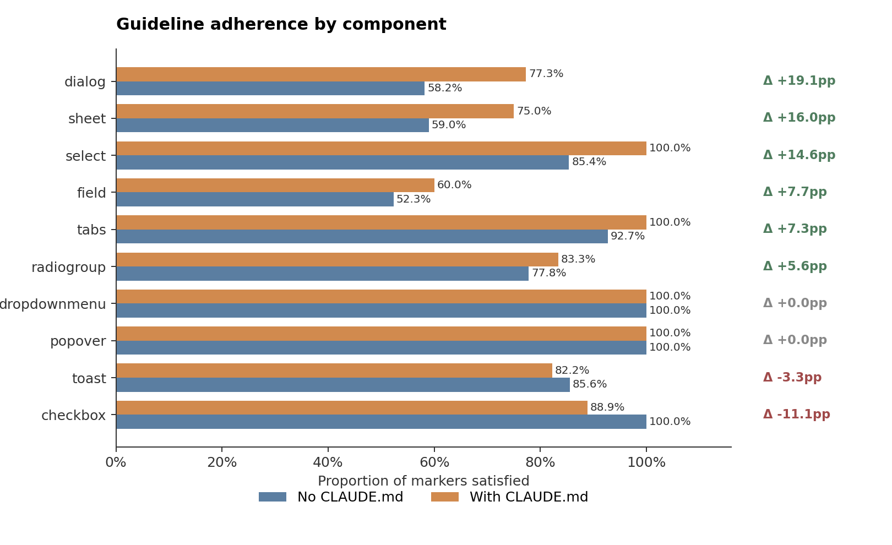
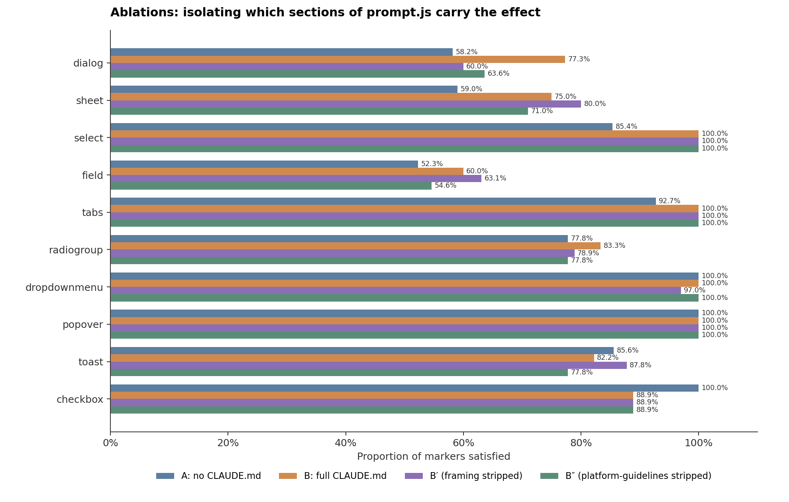

# Does AI-facing documentation actually move AI? I built some and ran 200 tests.

*Subtitle: a pre-registered A/B on the machine-facing half of a dual-audience documentation tool. The effect is real, modest, and not where I expected.*

---

At Amazon I spent three hours per component writing design documentation. The app team had no designated writer and most of the engineers who needed the docs couldn't read the technical ones. So I built a tool that read a component's JSON schema and produced human-readable guidelines cross-referenced against Apple's HIG, Material Design, and Shopify's Polaris. The three-hour job shrank to thirty minutes. The team used it. It worked.

The friction I never fixed was at the input: every draft started with me copy-pasting a schema. Last month I rebuilt the tool from scratch with two changes. First, pull the schema directly from the component library's source, so the tool can stand on its own. Second, produce two outputs from the same source, for two different audiences: the human-facing markdown I'd built the original tool for, and a compact machine-readable format that didn't need to exist when I wrote the first version.

The machine-facing audience is AI coding agents. And adding it reframed the whole project, because the problem the original tool solved is mostly gone.

## The problem shifted

The first tool solved a translation problem. Non-technical people on product teams couldn't read engineer-written documentation. That problem is evaporating. Designers are becoming design engineers. PMs are becoming tech leads. The roles that needed translation are gaining fluency or folding into engineering.

The new problem is worse. Walk into any team using shadcn/ui. They ran `npx shadcn@latest add button`. They renamed `destructive` to `critical`. They added a `loading` prop. They changed the padding. None of this is documented anywhere. The official shadcn docs are now 80% correct and 20% dangerously wrong for that team's codebase. The drift is structural: shadcn's "copy and paste" distribution model assumes you will mutate the components, and most teams that adopt it do. Teams that chose shadcn over MUI or Chakra chose it *because* they wanted to mutate.

What's structural here is the inversion of the usual mental model. With a conventional component library, the canonical `Button` lives upstream and your code imports it; when you customize via theming, you know you've diverged. With shadcn there is no upstream `Button` to diverge from. There's just the `Button` in your repo, which started as a snapshot of a reference that no longer matches. The upstream docs describe the reference. Your code uses something else. People feel like they're reading the right docs, and they're not.

This has always caused friction for new engineers and contractors, where any component customization eventually does. Now it causes the same friction for AI agents writing production UI. v0, Cursor, Claude Code, Bolt. A tech lead prompts one tool to build a settings page. Another PM prompts a different tool to build onboarding. Both get working code. Neither gets consistency, because the AI doesn't know your team renamed `destructive` to `critical` or that your Dialog has a custom focus trap. Without structured context for the actual component system, AI agents generate plausible-looking but wrong code.

The 0xminds team tested this directly: across 50 prompts, 34% of AI-generated shadcn components had API errors. Give the AI structured documentation as context and that dropped to 3%. That's the bet this new tool is placing.

## The thing I built is a prompt

What I actually made is a prompt. A versioned, modular prompt that encodes documentation expertise — editorial rules, accessibility reference material, template structure, output length constraints — and runs raw component docs through it. The prompt is the product. Everything else is either input to the prompt or output from it.

The prompt produces a single piece of structured content per component. That content then gets rendered in two forms for two audiences. For humans, it's markdown: a design-system doc you could publish to GitBook or a Mintlify site. For machines, it's a compact YAML representation of the same content with stable keys, wrapped in one of three agent-context envelopes: CLAUDE.md, AGENTS.md, or llms.txt. The CLAUDE.md everyone talks about is one envelope around one half of the tool's output. The tool is the prompt.

## How the tool works

There are three ways to feed it: type any shadcn/ui component name and it'll pull the raw MDX directly from the shadcn/ui, Radix UI, and Base UI GitHub repos at runtime. Paste a JSON schema for a custom component and it'll generate docs against whatever that schema says. Paste a TSX source file and it'll extract a schema using regex-based prop-pattern matching (interfaces, type aliases, cva variants, forwardRef patterns) and use that as the grounding material. The three paths converge: whatever you feed in, the output pipeline is the same.

The pipeline itself is five steps.

**Step one: fetch or extract.** For shadcn components, the tool issues HTTPS requests to GitHub's raw-content endpoints for the MDX source of that component. Current docs, not training data. This matters because shadcn ships updates and deprecations (Toast → Sonner happened last year), and a tool built on training snapshots would be months out of date on arrival. For custom schemas or TSX files, there's no fetch; the input becomes the grounding material directly.

**Step two: assemble the prompt.** The prompt that gets sent to Claude is composed from four versioned modules, each separately auditable:

- *Formatting rules* — non-negotiable editorial constraints (no em dashes, no passive voice, no "should," imperative phrasing, 15–20 word sentences).
- *Framing philosophy* — meta-rules for how the output should reason (lead with what to do; every guideline needs a "why"; be specific enough that an AI coding agent can emit correct code from the doc alone).
- *Template* — section structure (When to use, Do's and don'ts, Anatomy, Contracts, Variants, Placement, Editorial, Keyboard, ARIA, Accessibility, Common mistakes), with rules for when to omit sections.
- *Content modules* — three injected bodies of reference material:
  - `style-guide.js` encodes voice and phrasing conventions.
  - `platform-guidelines.js` encodes Apple HIG, Material Design, and WAI-ARIA patterns. (This one turns out to be doing more work than the others; more on that below.)
  - `semantic-guidelines.js` encodes the relationship between component choices and user intent.

**Step three: generate markdown.** The assembled prompt plus the fetched docs goes to Claude (Sonnet 4.6). The output is a markdown doc with deterministic section headings matching the template. That doc is designed to be read by humans: engineers checking the API, designers checking the editorial voice, PMs checking the use cases. It reads like a design-system doc site.

**Step four: transform to compact YAML.** The markdown goes through a deterministic Node.js post-processor (no second API call, no drift) that strips presentation — headings, bold markers, blank lines, visual hierarchy — and emits a compact YAML representation with stable keys: `use_when`, `do`, `dont`, `keyboard`, `aria`, `a11y`, `mistakes`. Bullet lists become arrays. Sections that didn't apply are absent, not empty. An agent parsing the output can pull `keyboard:` or `aria:` without reading markdown headings or inferring structure from prose.

Originally I expected the compact format to produce big token savings (30–50%). It doesn't. Actual savings are 3–5% on prose-dominated docs. The value turned out to be elsewhere: predictable structure, consistent keys, no parsing ambiguity. You can write an agent that reads compact YAML without ever teaching it to parse markdown.

**Step five: wrap as agent-context files.** The compact YAML gets wrapped in one of three envelopes, depending on which ecosystem the consumer is in: CLAUDE.md (fenced YAML block, usage instructions at the top, targeted at Claude Code), AGENTS.md (the OpenAI/generic-agent wrapper), or llms.txt (the "let an LLM read your site" spec from Jeremy Howard's group, with a summary-extraction pass). All three wrap the same underlying compact YAML. Different audiences, same source of truth.

A batch CLI can run this whole pipeline over a list of components and combine the outputs into one file (`node src/batch.js --components button,dialog,tabs --combine claude`), which is how you'd generate context for an entire component library in one pass.

None of this is sophisticated. It's five composable steps, each easy to version and audit. The design decision that mattered most in hindsight isn't the format or the pipeline or the fetch; it's splitting the prompt into separately-versioned modules. That split is what let me run the A/B I'm about to describe, because I could swap one module at a time and measure which parts were actually doing work.

You can read the rest of the pitch and see the code at [github.com/andiexchoi/shadcn-docs-from-schema](https://github.com/andiexchoi/shadcn-docs-from-schema).

## The moment of doubt

I shipped it. I wrote a README explaining why it matters. I linked to the academic papers on documentation drift and the survey data on design system decay and the industry reports on AI-generated code quality. The thesis made sense. The architecture made sense. The output looked good.

And then I realized I had no idea if the machine-facing half worked.

The humans-facing half is self-evident. Markdown documentation is markdown documentation. If someone reads a shadcn design-system doc that the tool generated, they can use it or they can't, and that's a question I can answer by handing it to a designer and asking. The machine-facing half is different. The premise there is that if you feed AI coding agents a structured reference for your component system, they will write code that hews closer to your system's actual conventions. Plausible. Everyone is building on that premise. I haven't seen anyone publish a clean test of it, for their own tool or anyone else's. Most of what I've seen is anecdata, cherry-picked screenshots, and confident pitches.

I built a prompt that produces AI-facing output. I was telling other people the AI-facing output would change what AI writes. If my prompt was actually doing useful work on that side, I wanted to defend it with a number. If it wasn't, I wanted to know before more people adopted it.

So I ran the A/B on that half.

## How I tested it

Ten components, chosen for distinct failure profiles: Dialog, Sheet, Select, Field, Tabs, DropdownMenu, Popover, Toast (Sonner), Checkbox, RadioGroup. Two conditions: Condition A sent Claude Sonnet a ticket-style prompt with no CLAUDE.md. Condition B sent the same prompt with the machine-facing output of my tool, wrapped as a CLAUDE.md, included in the system prompt. Ten runs per cell. 200 total generations.

The tickets looked like real product tickets:

> Build a reusable confirm-delete dialog for deleting a project. User has to type the project name to confirm. Use shadcn/ui.

Nothing in the prompt said `DialogTitle`, `aria-describedby`, `prefers-reduced-motion`, or any other guideline the tool is supposed to encode. A real ticket wouldn't either.

Each generated `.tsx` file got scored against 7 to 13 pre-registered markers per component. 104 markers in total, split across three tiers: structural (regex checks for the presence of specific primitives), behavioral (regex checks for prop wiring patterns), and semantic (an LLM-as-judge scoring editorial and accessibility qualities that regex can't catch, like "is the dialog title framed as a question that names the subject?").

Rules were locked before any scored run. I caught one regex bug in a dry run and documented the fix in the pre-registration before moving on. The pre-registration itself, with every marker, prompt, scaffold, and analysis decision, was committed to git before the primary 200-generation matrix started. If you want to verify nothing got tweaked after seeing the results, the git history is there.

## What the test showed

**80% to 86%.**

Condition A satisfied 79.9% of the pre-registered guidelines. Condition B satisfied 86.3%. Absolute delta of 6.3 percentage points. 95% confidence interval of [2.3%, 10.4%]. Across 25 non-tied markers, 21 moved in the CLAUDE.md's favor and 4 moved against. Sign test p = 0.0009.

The effect is real. The effect is not large. It is not a transformation. It's polish.

## What moved

The 6.3 points aren't spread evenly. They concentrate on specific markers where Sonnet's default basically never does the thing, and the CLAUDE.md makes it reliable:

- `dialog-motion-reduce`: respecting the OS-level reduced-motion setting by adding `motion-reduce:` classes. Condition A: 0%. Condition B: 80%.
- `select-uses-groups-for-regions`: grouping timezone options by continent instead of dumping them as a flat list. A: 0%. B: 100%.
- `dialog-title-question-framing`: writing "Delete Project X?" instead of a generic "Delete project" label. A: 0%. B: 70%.
- `dialog-aria-describedby-explicit`: wiring `aria-describedby` explicitly instead of trusting Radix to handle it implicitly. A: 40%. B: 100%.

These are the kinds of details a good design reviewer catches and a hurried developer misses. They are also the kinds of details that don't show up in a library's README but do show up in its design guidelines, its platform accessibility specs, and the internal conventions of teams that have hit these failure modes before. Encoding them and giving them to the AI as context actually moves what the AI writes.

What doesn't move much: the canonical API shape. `<DialogTrigger>`, `variant="destructive"`, `onOpenChange`. Sonnet already gets those right. Four of the ten components scored 100% in both conditions because Sonnet's default output was already adherent. For those, the CLAUDE.md has nothing to contribute.

## Two regressions that weren't what they looked like

Two components scored lower under CLAUDE.md than without. Checkbox dropped 11 percentage points. Toast dropped 3. Both look bad in the aggregate. Both are more interesting than "CLAUDE.md made the code worse."

The Checkbox drop came from a single marker, `checkbox-label-htmlfor`. My regex checked whether the output used `<Label htmlFor="...">` to associate labels with inputs. Condition A hit this 100% of the time. Condition B hit it 0% of the time.

Except the Condition B outputs were correctly associating labels with inputs. They just weren't using `<Label>`. They were using `<FieldLabel>`, because the Checkbox CLAUDE.md explicitly says:

> Pair every checkbox with a visible label using Field and FieldLabel.

The CLAUDE.md gave the model a more specific instruction than the general-convention Label pattern. The model followed that instruction correctly. My scoring regex only accepted the general convention. I caught the same class of bug in a dry run and fixed it before the main scored matrix; I missed this instance and it made it into the locked rubric. The pre-registration safeguards say I can't change markers post-hoc, so the −11 is reported as-is, with a sensitivity analysis showing that the corrected delta is essentially zero.

The Toast regression is a different shape entirely. My rubric rewarded error toasts that included either a `duration` override or an `action` object, based on the common UX heuristic that error states need longer display time or a recovery path. The Sonner CLAUDE.md my tool generated takes a more specific position, faithful to what Sonner's own docs say:

> For errors that require a user response, use inline validation or a dialog instead.
> 
> `toast.error()`: Use for failures the system detected automatically, where no immediate user input is required.

So the Condition B outputs produced briefer error toasts without duration or action, following the library's specific contract. My general-convention marker punished that. Whose guidance is right depends on whose framing you accept. The CLAUDE.md isn't producing worse code. It's encoding a library-specific position that disagrees with a widely-held general convention.

These two cases are the most useful thing I learned from running the test. They expose how slippery "did the CLAUDE.md help?" actually is. A rubric built from general best practices will sometimes penalize a CLAUDE.md for doing exactly what it's supposed to do: teaching the model the library's actual contract instead of what most libraries do.

## What's carrying the effect

The headline number is for the full `prompt.js` pipeline: framing rules, template, output budget, and three content modules (style guide, platform guidelines, semantic guidelines). That raised a question worth answering: which parts of the pipeline are actually doing the work?

I ran two ablations. For each, I generated the 10 CLAUDE.md files with one section of `prompt.js` stripped, then re-ran 100 Condition B generations against those stripped CLAUDE.md files.

- **Without the framing philosophy and formatting rules** (B′): 85.1%. Down 1.2 points from the full B.
- **Without the platform-guidelines module** (Apple HIG, Material Design, ARIA patterns): 82.9%. Down 3.4 points from the full B.

The platform-guidelines module carries about 54% of the total CLAUDE.md effect. It is specifically responsible for the Dialog motion-reduce gain (80 points), the Dialog aria-describedby wiring (70 points), and much of the Dialog title framing (60 points). Strip that module and those wins vanish. The model has to emit code about dialogs, but it no longer has the encoded a11y context to know that respecting `prefers-reduced-motion` is the right default or that explicit ARIA wiring beats trusting Radix's defaults.

The framing philosophy is more modest in aggregate, but it's the thing making the CLAUDE.md's imperatives land. "Respect prefers-reduced-motion" as a flat bullet doesn't move the needle. "Pair color-based error styling with icon and text because color alone fails WCAG contrast for users with color blindness" does. The framing rule "every guideline needs a why" is what produces the second kind of sentence. Strip it and you get the first kind.

Three more modules are still intact in both ablations (style guide, semantic guidelines, output budget). They account for the remaining ~1.7 percentage points. I haven't run those yet.

## What this isn't

These numbers are for Claude Sonnet 4.6 at temperature 1. Opus, Haiku, GPT, Gemini are separate experiments. Every model is its own answer.

The prompts are ticket-style and single-shot. Real product work is multi-step, multi-component, and iterative. The effect might grow with iteration (the CLAUDE.md's context compounds across turns) or shrink (the model drifts away from it as the conversation gets longer). I haven't measured.

The rubric has blind spots. The Checkbox regression showed one. The Toast regression showed another. Every rubric will have some. The honest framing for any measurement like this is: "against this specific set of pre-registered markers, the effect was X."

Four components saw zero movement because Sonnet was already at ceiling. That's a real limit. CLAUDE.md cannot help where there is nothing left to help. If your team's components are all well-documented primitives the model has seen in training, the tool has less to offer than if your team has heavily forked the library.

## What this is

The machine-facing output of my documentation tool, when given to Claude Sonnet as system-prompt context, closes about a third of the gap between Sonnet's capable-but-generic default adherence and what the library's documentation actually specifies. A defensible claim with a 95% confidence interval I can point at. Narrower than the usual pitch for this class of tool. Also true.

The work doesn't happen at the level of API shape. The model already knows API shape. It happens on the long tail of editorial and accessibility judgments a good design reviewer catches, a ticket never spells out, and a team's conventions encode in ways training data does not. Timezone grouping. Motion sensitivity. Title framing. Explicit ARIA wiring. The stuff that makes a component feel designed instead of auto-generated.

So the pitch that holds up is specific to what I built, not to CLAUDE.md in the abstract. My prompt, run against the current shadcn docs, produces AI-facing output that closes about a third of the adherence gap, concentrated on guidelines a designer would catch. Different upstream docs, a different prompt, a different model — different numbers. The architecture is testable. That's what the pre-registration and the ablations give you.

If you're shipping a CLAUDE.md from your own pipeline: it's doing something, it's not doing nothing, and the thing determining how much it does is whether the prompt you're running encodes what your team actually ships. If your prompt is a two-paragraph "here are our conventions" afterthought, the measurable effect on AI-generated code will match. If it encodes external a11y specs and editorial posture the way the platform-guidelines module in my tool does, you get closer to what I measured.

If you're thinking of building a documentation pipeline of the kind I built: the most load-bearing input is not the framing, not the output format, not the envelope choice. It's the external reference material that encodes what platform standards and accessibility specs say. Half of the measurable effect I saw traced directly to the platform-guidelines module. If you want a tool like this to do more for the AI-facing audience, that's where to invest.

## For the curious

Full writeup with statistical methodology, per-marker tables, Clopper-Pearson CIs, sign tests, bootstrap, and the full regression investigation: [RESULTS.md](https://github.com/andiexchoi/shadcn-docs-from-schema/blob/ab-experiment/eval/ab-experiment/RESULTS.md).

Pre-registration (locked before any scored run): [PRE_REGISTRATION.md](https://github.com/andiexchoi/shadcn-docs-from-schema/blob/ab-experiment/eval/ab-experiment/PRE_REGISTRATION.md).

Scoring code, all 220 generated `.tsx` files, and the exact CLAUDE.md content used as Condition B context: all in the same branch.

If you want to run this on a different model or a different library, the harness is reusable. I'd genuinely love to see what the numbers look like elsewhere.
